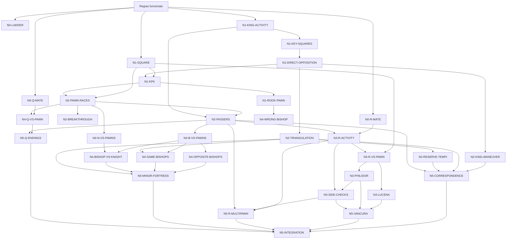

# Currículo Oficial — Laboratório de Finais

# . Matriz curricular oficial

## N0 — Conversão e segurança

| ID | Classe | Competência / objetivo observável | Pré-requisitos | Por que aqui | Domínio |
|---|---|---|---|---|---|
| `N0-Q-MATE` | E | Mate de dama e rei: restringir, aproximar o rei e finalizar sem afogamento/perda da dama | entrada | conversão mais simples e base para finais de dama | D1 |
| `N0-R-MATE` | E | Mate de torre e rei: construir/reduzir a caixa com apoio do rei | entrada | ensina corte, rei ativo e coordenação | D1 |
| `N0-LADDER` | E | Mate da escadinha: criar barreiras sucessivas e alternar torres | movimentos de torre/xeque | técnica concreta, visual e útil para restrição espacial | D1 |
| `N0-2B-MATE` | R | Mate com dois bispos: coordenar rei e diagonais até a borda/canto | noção de restrição N0 | amplia coordenação de peças, mas não é requisito para o avançado v1.0 | D1 se estudada |

| ID | Demonstração, prática e fading | Erros típicos | Transferência e revisão | Dependências posteriores |
|---|---|---|---|---|
| `N0-Q-MATE` | caixa/limitação visual -> prática com zona -> mate limpo sem zona | cheques sem plano; dama solta; afogamento; rei passivo | rei adversário em outra região; revisão em dama vs peão | `N4-Q-VS-PAWN`, `N5-Q-ENDINGS` |
| `N0-R-MATE` | corte por fileira/coluna + aproximação do rei -> execução limpa | cheques inúteis; rei distante; entrega da torre | posição espelhada e rei central | `N3-R-ACTIVITY`, `N3-R-VS-PAWN` |
| `N0-LADDER` | barreiras explícitas -> prática guiada -> posição C com várias decisões | mover sempre a mesma torre; aproximar torre vulnerável; perder barreira | obrigatória em geometria diferente; reaparece como conceito de corte | `N3-R-ACTIVITY` |
| `N0-2B-MATE` | zonas diagonais e condução -> fading procedural | bispos sem coordenação; rei passivo; permitir fuga | outra orientação de cores/canto | enriquecimento, sem dependência obrigatória |

## N1 — Rei e peão fundamentais

| ID | Classe | Competência / objetivo observável | Pré-requisitos | Por que aqui | Domínio |
|---|---|---|---|---|---|
| `N1-KING-ACTIVITY` | E | Preferir atividade correta do rei e usá-lo para escoltar/bloquear peões | entrada | o rei é peça central de quase todo final posterior | D3 |
| `N1-SQUARE` | E | Regra do Quadrado: decidir se o rei alcança um passador sem calcular toda a corrida | movimento de rei/peão | ferramenta geométrica simples antes de cálculo complexo | D2 |
| `N1-KEY-SQUARES` | E | Identificar casas-chave e conduzir o rei até elas | `N1-KING-ACTIVITY` | transforma “rei ativo” em objetivo posicional concreto | D2 |
| `N1-DIRECT-OPPOSITION` | E | Usar/ceder oposição para alcançar ou negar uma casa-chave | `N1-KEY-SQUARES` | oposição é ensinada como meio, não como mantra | D2 |
| `N1-KPK` | E | Avaliar e jogar K+P vs K, inclusive 6ª/7ª fileira e diferença por turno | `N1-SQUARE`, `N1-KEY-SQUARES`, `N1-DIRECT-OPPOSITION` | integra a gramática fundamental | D2 |
| `N1-ROOK-PAWN` | E | Reconhecer e jogar exceções do peão de torre | `N1-KPK` | impede generalização falsa das regras centrais | D2 |

| ID | Demonstração, prática e fading | Erros típicos | Transferência e revisão | Dependências posteriores |
|---|---|---|---|---|
| `N1-KING-ACTIVITY` | comparar avanço prematuro do peão vs melhora do rei; retirar destaque do lance | tratar rei como peça a esconder; empurrar automaticamente | alas/arquivos diferentes; revisão frequente | N2-N5 amplamente |
| `N1-SQUARE` | construir zona -> reduzir desenho -> decisão sem marcação | contar errado; ignorar lado a jogar; confundir promoção/captura | posição diferente obrigatória; revisão em corridas/torre/dama vs peão | `N2-PAWN-RACES`, `N3-R-VS-PAWN`, `N4-Q-VS-PAWN` |
| `N1-KEY-SQUARES` | relação entre peão e casas-alvo -> rotas diferentes | decorar FEN; buscar oposição sem objetivo; casa-alvo errada | colunas/ranks diferentes | `N1-DIRECT-OPPOSITION`, `N1-KPK`, `N2-KING-MANEUVER` |
| `N1-DIRECT-OPPOSITION` | mostrar objetivo após a oposição -> vitória e defesa | “pegar oposição” quando não serve; ignorar casa-chave | posição C diferente nos dois papéis | `N1-KPK`, `N2-KING-MANEUVER`, `N2-TRIANGULATION` |
| `N1-KPK` | integrar casos de avanço/manobra/turno; variar posição | empurrar cedo; bloquear o rei; aplicar regra de 6ª fora de contexto | mistura win/draw e execuções completas | árvore de peões e transições N3-N5 |
| `N1-ROOK-PAWN` | contraste com peão central; borda explicitada e depois retirada | supor que rei à frente sempre vence; ignorar canto | a/h, cores e lado a jogar variados | `N4-WRONG-BISHOP`, exceções de torre |

**Regra editorial:** os casos atuais separados de peões `c/e/f` na sexta fileira são posições/práticas de `N1-KPK`, não competências independentes.

## N2 — Peões dinâmicos e zugzwang

| ID | Classe | Competência / objetivo observável | Pré-requisitos | Por que aqui | Domínio |
|---|---|---|---|---|---|
| `N2-KING-MANEUVER` | E | Oposição distante/diagonal, outflanking e shouldering para escolher a rota correta do rei | `N1-DIRECT-OPPOSITION`, `N1-KPK` | generaliza oposição para manobra | D3 |
| `N2-TRIANGULATION` | E | Reconhecer zugzwang recíproco e perder um tempo de forma útil | `N1-DIRECT-OPPOSITION` | primeiro mecanismo explícito de manipulação de turno | D3 |
| `N2-RESERVE-TEMPI` | E | Conservar/usar tempos de peão para transferir a obrigação de mover | `N2-TRIANGULATION` | amplia zugzwang para estruturas de vários peões | D3 |
| `N2-PAWN-RACES` | E | Calcular promoções concorrentes considerando captura, xeque e ordem dos lances | `N1-SQUARE`, `N1-KPK` | converte geometria em cálculo concreto | D2/D3 |
| `N2-BREAKTHROUGH` | E | Sacrificar peão(s) para criar passador imparável | `N2-PAWN-RACES` | introduz transformação material deliberada | D3 |
| `N2-PASSERS` | E | Criar, avançar, bloquear ou usar passador protegido/distante e escolher liquidação correta | `N1-KING-ACTIVITY`, `N2-PAWN-RACES` | base estratégica para torres e peças menores | D3 |
| `N2-RETI` | R | Usar geometria do rei para atender dois objetivos simultaneamente | `N1-SQUARE`, `N2-PAWN-RACES` | motivo clássico de alto valor geométrico, não bloqueante | D2/D3 se estudada |

| ID | Demonstração, prática e fading | Erros típicos | Transferência e revisão | Dependências posteriores |
|---|---|---|---|---|
| `N2-KING-MANEUVER` | linhas de rota/oposição -> retirar marcações | perseguir oposição sem objetivo; caminho curto mas errado em tempos | outro eixo/ala | `N5-CORRESPONDENCE`, finais de peças |
| `N2-TRIANGULATION` | comparar mesma estrutura com lado a jogar invertido -> execução sem setas | triangular sem zugzwang; mover peão irreversível cedo | ciclo de rei diferente | `N2-RESERVE-TEMPI`, `N4-SAME-BISHOPS`, `N5-CORRESPONDENCE` |
| `N2-RESERVE-TEMPI` | destacar tempos disponíveis -> retirar destaque | gastar reserva cedo; esquecer resposta rival | reservas em alas diferentes | `N5-CORRESPONDENCE` |
| `N2-PAWN-RACES` | cálculo curto -> maior; sem engine em runtime | promoção sem considerar xeque/captura; erro de turno | mistura win/draw/loss | `N2-BREAKTHROUGH`, `N2-PASSERS`, `N4-Q-VS-PAWN` |
| `N2-BREAKTHROUGH` | motivo sacrificial antes da linha -> defensor variado | recusar sacrifício; peão errado; passador bloqueável | estrutura invertida/equivalente | multi-peões e transições |
| `N2-PASSERS` | comparar protegido/distante/irrelevante -> escolha de plano | avançar automaticamente; abandonar rei; liquidação ruim | posições com planos plausíveis | `N3-R-ACTIVITY`, `N5-R-MULTIPAWN`, `N5-INTEGRATION` |
| `N2-RETI` | dupla finalidade visual -> sem área | correr só para um objetivo; contar distância de forma inadequada | orientação diferente | enriquecimento geométrico |

## N3 — Torres fundamentais

| ID | Classe | Competência / objetivo observável | Pré-requisitos | Por que aqui | Domínio |
|---|---|---|---|---|---|
| `N3-R-ACTIVITY` | E | Priorizar torre/reis ativos, cortar rei e posicionar torre funcionalmente em relação ao passador | `N0-R-MATE`, `N1-KING-ACTIVITY`, `N2-PASSERS` | princípios antes dos landmarks decoráveis | D3 |
| `N3-R-VS-PAWN` | E | Avaliar e jogar torre contra peão avançado com distância, corte e cheques | `N1-SQUARE`, `N3-R-ACTIVITY` | ponte entre fundamentos e R+P vs R | D2/D3 |
| `N3-LUCENA` | E | Reconhecer a família vencedora e executar ponte/método validado | `N3-R-ACTIVITY`, `N3-R-VS-PAWN` | landmark ofensivo essencial | D1 |
| `N3-PHILIDOR` | E | Reconhecer e executar a defesa de Philidor | `N3-R-ACTIVITY`, `N3-R-VS-PAWN` | landmark defensivo complementar | D1 |
| `N3-SIDE-CHECKS` | E | Escolher lado curto/longo, distância e cheques laterais | `N3-PHILIDOR`, `N3-R-ACTIVITY` | generaliza defesa ativa além da posição canônica | D3 |
| `N3-DEFENSIVE-EXCEPTIONS` | R | Reconhecer defesas passiva/frontal e exceções de peões de torre/cavalo | `N3-LUCENA`, `N3-PHILIDOR`, `N3-SIDE-CHECKS` | amplia robustez sem virar catálogo obrigatório | D3 se estudada |

| ID | Demonstração, prática e fading | Erros típicos | Transferência e revisão | Dependências posteriores |
|---|---|---|---|---|
| `N3-R-ACTIVITY` | corte/cheques e comparação ativo-passivo -> decisão limpa | caça a peão que perde atividade; rei passivo; torre mal colocada | alas/peões diferentes | todos os finais de torre posteriores |
| `N3-R-VS-PAWN` | corte + tempo de promoção -> prática win/draw | checar quando precisa aproximar; permitir abrigo; ignorar promoção | mistura de resultados | `N3-LUCENA`, `N3-PHILIDOR`, N5 torre |
| `N3-LUCENA` | objetivo estrutural antes da variante -> posição de aproximação | decorar “quarta fileira”; ponte cedo/tarde | reconhecer destino Lucena e executar em configuração diferente | `N5-VANCURA`, `N5-INTEGRATION` |
| `N3-PHILIDOR` | função da terceira fileira -> defesa completa | abandonar barreira cedo; cheques por trás prematuros | posição próxima e configuração diferente | `N3-SIDE-CHECKS`, `N5-R-MULTIPAWN` |
| `N3-SIDE-CHECKS` | lado curto/longo e distância -> retirar zonas | rei no lado errado; torre perto demais; cheques sem distância | posição espelhada/peão diferente | `N5-VANCURA`, `N5-R-MULTIPAWN` |
| `N3-DEFENSIVE-EXCEPTIONS` | comparar caso normal/exceção -> classificação | aplicar Lucena/Philidor mecanicamente | revisão N5 | casos avançados posteriores |

## N4 — Peças menores e dama básica

| ID | Classe | Competência / objetivo observável | Pré-requisitos | Por que aqui | Domínio |
|---|---|---|---|---|---|
| `N4-Q-VS-PAWN` | E | Distinguir famílias de dama contra peão avançado e executar o método | `N0-Q-MATE`, `N1-SQUARE`, `N2-PAWN-RACES` | primeira relação reduzida de dama após fundamentos de peões | D2 |
| `N4-N-VS-PAWNS` | E | Usar bloqueio, rota e táticas do cavalo contra peão(s) | `N2-PAWN-RACES` | introduz alcance discreto da peça menor | D3 |
| `N4-WRONG-BISHOP` | E | Reconhecer bispo errado + peão de torre e a fortaleza do canto | `N1-ROOK-PAWN` | aplicação direta de exceções de borda | D2 |
| `N4-B-VS-PAWNS` | E | Bloquear/impedir peões conectados ou separados com bispo e rei | `N2-PASSERS`, `N2-PAWN-RACES` | base para todos os finais de bispo | D3 |
| `N4-OPPOSITE-BISHOPS` | E | Reconhecer mecanismos de bloqueio/fortaleza em bispos de cores opostas | `N4-B-VS-PAWNS` | família defensiva de grande valor prático | D3 |
| `N4-SAME-BISHOPS` | E | Usar rei ativo, fixação, diagonais e zugzwang com bispos da mesma cor | `N4-B-VS-PAWNS`, `N2-TRIANGULATION` | adiciona luta pela mesma cor de casas | D3 |
| `N4-BISHOP-VS-KNIGHT` | E | Avaliar condições de bispo vs cavalo e transformar/converter posições reduzidas | `N4-N-VS-PAWNS`, `N4-B-VS-PAWNS` | integra as duas famílias menores | D3 |

| ID | Demonstração, prática e fading | Erros típicos | Transferência e revisão | Dependências posteriores |
|---|---|---|---|---|
| `N4-Q-VS-PAWN` | famílias por coluna/rei -> classificação misturada -> execução | cheques infinitos; rei não aproxima; promoção com tempo/xeque | centro/cavalo/bispo/torre, cores e turno variados | `N5-Q-ENDINGS` |
| `N4-N-VS-PAWNS` | casas alcançáveis em tempos -> retirar mapa | contar cavalo como rei; chegar tarde; ignorar garfo/promoção | arquivos diferentes | `N5-MINOR-FORTRESS` |
| `N4-WRONG-BISHOP` | comparar bispo certo/errado e canto -> sem rótulo | “peça extra sempre vence”; expulsar rei para canto correto | cores/cantos espelhados | `N5-MINOR-FORTRESS` |
| `N4-B-VS-PAWNS` | diagonal de bloqueio + rei -> estruturas novas | atacar peão errado; abandonar diagonal; passividade desnecessária | conectados/separados | bispos e N5 |
| `N4-OPPOSITE-BISHOPS` | cor das casas e bloqueio -> mistura win/draw | contar material sem cor das casas; rei no setor errado | passadores distintos | `N5-MINOR-FORTRESS` |
| `N4-SAME-BISHOPS` | fixação/mudança de diagonal/zugzwang -> plano limpo | trocar bispo ativo; fixar peões mal; rei passivo | outra estrutura | `N5-MINOR-FORTRESS`, `N5-INTEGRATION` |
| `N4-BISHOP-VS-KNIGHT` | comparar posições abertas/fechadas -> escolher transformação | regra absoluta “bispo/cavalo melhor”; ignorar passador | uma posição favorável a cada peça + equilibrada | `N5-MINOR-FORTRESS`, `N5-INTEGRATION` |

## N5 — Avançado v1.0

Todas as competências abaixo são `A`.

| ID | Competência / objetivo observável | Pré-requisitos | Por que aqui | Domínio |
|---|---|---|---|---|
| `N5-CORRESPONDENCE` | Casas correspondentes/minadas e peões complexos: identificar relações que não se reduzem à oposição simples | `N2-KING-MANEUVER`, `N2-TRIANGULATION`, `N2-RESERVE-TEMPI`, `N2-PASSERS` | culmina a árvore de peões | D4 |
| `N5-VANCURA` | Reconhecer a família Vancura e executar a defesa lateral | `N3-LUCENA`, `N3-PHILIDOR`, `N3-SIDE-CHECKS` | landmark avançado com dependência real de geometria de torre | D4 |
| `N5-R-MULTIPAWN` | Jogar finais práticos de torre com vários peões por princípios e transições | `N3-R-ACTIVITY`, `N3-PHILIDOR`, `N3-SIDE-CHECKS`, `N2-PASSERS` | transfere landmarks para situações menos “de livro” | D4 |
| `N5-MINOR-FORTRESS` | Reconhecer/construir/quebrar fortalezas e bloqueios selecionados de peças menores | todos os `E` de N4 + `N2-TRIANGULATION` | integra peças menores com zugzwang e transformação | D4 |
| `N5-Q-ENDINGS` | Jogar finais de dama selecionados por princípios: atividade, rei, perpétuo, passador e amostra de Q+P vs Q | `N4-Q-VS-PAWN`, `N2-PASSERS`, `N0-Q-MATE` | amplia dama sem pretensão enciclopédica | D4 |
| `N5-INTEGRATION` | Em posição não rotulada, reconhecer endpoint teórico, escolher simplificação/transição e executar técnica relevante | `N5-CORRESPONDENCE`, `N5-VANCURA`, `N5-R-MULTIPAWN`, `N5-MINOR-FORTRESS`, `N5-Q-ENDINGS` e `E` relevantes | mede transferência real e encerra a v1.0 | D4 + avaliação mista |

| ID | Demonstração, prática e fading | Erros típicos | Transferência e revisão | Continuação futura |
|---|---|---|---|---|
| `N5-CORRESPONDENCE` | pares claros -> relação não visível -> pouca ajuda final | reduzir tudo a oposição; perder reserva; casa “natural” errada | estruturas diferentes + revisão mista | peões especialistas N6+ |
| `N5-VANCURA` | função dos cheques laterais antes da sequência -> execução sem marcação | defesa passiva; torre perto; rei no lado errado | canônica + aproximação + espelho | teoria profunda de torres N6+ |
| `N5-R-MULTIPAWN` | comparar planos/trade-offs; atividade e transição antes de material | capturar peão e perder atividade; rei passivo; liquidação ruim | posições reais/CC0 variadas; revisão com Lucena/Philidor/Vancura | finais complexos N7 |
| `N5-MINOR-FORTRESS` | condição estrutural da fortaleza -> construir/quebrar | vantagem material = vitória; quebrar bloqueio próprio; zugzwang mal avaliado | famílias distintas | relações especiais N6/N8 |
| `N5-Q-ENDINGS` | prioridades práticas + objetivos intermediários; linhas curtas | trocar damas para final ruim; cheques sem objetivo; expor rei; perder perpétuo | posições reais variadas; revisão com Q vs P | dama profunda N6 |
| `N5-INTEGRATION` | não ensina nova receita; posição sem rótulo exige diagnóstico antes do lance | escolher técnica errada; simplificar por material; não identificar resultado-alvo | é a transferência terminal; revisão atrasada obrigatória | conclusão v1.0 |

### Limites aprovados para as famílias amplas do N5

- `N0-2B-MATE` permanece **Recomendada**, não requisito da v1.0.
- `N5-Q-ENDINGS` cobre princípios práticos e **seleção representativa** de `Q+P vs Q`; cobertura exaustiva fica pós-v1.0.
- `N5-R-MULTIPAWN` cobre atividade, corte do rei, torre atrás/ao lado do passador, peão extra, peões em uma ou duas alas, defesa ativa e decisões de transição; não vira catálogo de tablebase/posições exatas.

---

# 8. Dependências, desbloqueio e rota recomendada

## 8.1 Regra de desbloqueio

Três conceitos são distintos:

- **desbloqueio de competência:** exige apenas os pré-requisitos reais daquela competência;
- **conclusão de nível:** exige domínio dos `E` daquele nível;
- **rota recomendada:** ordem pedagógica padrão mostrada ao aluno iniciante em finais.

Assim, uma competência não fica artificialmente bloqueada por conteúdo independente. Exemplos: `N1-KING-ACTIVITY` e `N1-SQUARE` podem começar a partir da entrada funcional do curso; nenhum deles depende de um mate específico de N0.

## 8.2 Grafo editorial principal

Competências `R` não aparecem como dependência obrigatória.

---

# 9. Progressão e conclusão

- **N0 concluído:** `N0-Q-MATE`, `N0-R-MATE`, `N0-LADDER` dominados.
- **N1 concluído:** todos os `E` de N1 dominados; oposição/casas-chave usadas como meios para objetivo real.
- **N2 concluído:** todos os `E` de N2 dominados na rota recomendada.
- **N3 concluído:** todos os `E` de N3 dominados na rota recomendada.
- **N4 concluído:** todos os `E` de N4 dominados.
- **Avançado v1.0:** todos os `E`, todos os `A`, `N5-INTEGRATION` e revisão mista posterior aprovados.

Não existe rating mínimo ou rating terminal.

---

# 10. Fronteira explícita do Avançado v1.0

## 10.1 Envelope

A v1.0 cobre técnicas e princípios canônicos em posições reduzidas onde, como regra editorial, cada lado possui **no máximo uma peça não-peão além do rei**, com exceções deliberadas de conversão elementar como duas torres ou dois bispos.

Esse envelope não obriga cobertura exaustiva. Conteúdo entra por valor prático, generalização ou importância estrutural.

### Famílias incluídas

- mates elementares selecionados;
- rei e peões do elementar ao avançado selecionado;
- torre contra peão;
- torre+peão contra torre, incluindo Lucena, Philidor, cheques laterais/lado curto-longo e Vancura;
- princípios selecionados de finais de torre com múltiplos peões;
- cavalo contra peão(s) e finais reduzidos selecionados de cavalo;
- bispo contra peão(s), bispos iguais/opostos e bispo vs cavalo reduzido;
- dama contra peão(s);
- finais de dama selecionados, incluindo princípios práticos e amostra de dama+peão vs dama;
- fortalezas e transições selecionadas;
- integração: reconhecer qual final teórico buscar ou evitar.

## 10.2 Fora da v1.0

- mate de bispo+cavalo;
- torre+bispo vs torre;
- torre+cavalo vs torre;
- dama vs torre como corpo teórico obrigatório;
- cobertura exaustiva de dama+peão vs dama;
- tablebases de 6/7 peças como catálogo curricular;
- finais complexos com várias peças de cada lado;
- relações materiais raras em abordagem enciclopédica;
- estudos artísticos como núcleo obrigatório;
- memorização de longas variantes de baixa generalização.

## 10.3 Competência terminal

Diante de posição **não rotulada e não vista anteriormente** dentro do envelope, o aluno avançado v1.0 deve conseguir:

1. avaliar o objetivo prático imediato;
2. reconhecer mecanismo, landmark ou princípio relevante;
3. escolher plano/transição coerente;
4. executar a técnica crítica sem ajuda;
5. defender quando a família exige defesa;
6. evitar simplificação que transponha para final conhecido desfavorável.

---

# 11. Trilha pós-v1.0

Esta trilha documenta continuidade lógica, sem antecipar implementação.

## N6 — Especialista teórico

- mate de bispo+cavalo;
- torre+bispo vs torre;
- torre+cavalo vs torre;
- dama vs torre e extensões com peões;
- dama+peão vs dama em maior profundidade;
- torre contra múltiplos peões e R+2P vs R(+P) com maior cobertura;
- finais de cavalo avançados e relações especiais justificadas;
- casas correspondentes/minadas em estruturas mais complexas.

## N7 — Finais complexos práticos

- torre+peça menor vs torre+peça menor;
- dama+peça menor e dama+torre em finais práticos;
- desequilíbrios de qualidade com múltiplos peões;
- duas peças menores por lado;
- várias peças e peões em duas alas;
- transformações entre finais complexos e landmarks conhecidos;
- criação de duas fraquezas, defesa prática e atividade em material maior.

## N8 — Maestria e investigação

- tablebases de 6/7 peças como objeto sistemático de estudo;
- fortalezas raras e descobertas de tablebase;
- zugzwangs/correspondências de alta complexidade;
- estudos artísticos selecionados para cálculo, geometria e criatividade;
- teoria histórica especializada;
- síntese de finais de nível mestre com cálculo profundo e múltiplas transformações.

---

# 12. Política de fontes, posições e direitos autorais

## 12.1 Princípio operacional

**Agentes, IA e automações não podem compor posições curriculares. Toda posição que possa chegar ao aluno deve ter origem humana externa rastreável.**

Pipeline preferencial:

`competência -> consultar Source Corpus -> localizar página/diagrama/exemplo humano concreto -> transcrever/derivar mecanicamente -> validar proveniência/regras -> QA enxadrístico -> revisar pedagogia -> publicar`

Busca externa aberta é fallback para lacunas reais ou variedade insuficiente do perfil D1–D4. O cânone primário e seu mapa de cobertura estão em `docs/SOURCE-CORPUS.md`.

Para partidas reais, preferir PGN verificável e derivar FEN mecanicamente. Para posições teóricas históricas, preferir fonte primária/histórica ou edição em domínio público rastreável.

## 12.2 Hierarquia de fontes

Para descoberta de posições, consultar primeiro o **Source Corpus primário**:

1. Capablanca — _Chess Fundamentals_, edição de 1921;
2. Kling & Horwitz — _Chess Studies and End-Games_, 2ª edição de 1889, revista por William Wayte.

Freeborough — _Chess Endings_ (1891) permanece reserva. Fora do corpus, priorizar domínio público verificável, CC0/licença aberta e partidas reais rastreáveis; livros modernos podem servir como referência pontual conforme a política editorial.

Não existe fallback de posição própria/reconstruída por agente. Se o corpus e a busca externa não resolverem uma necessidade, registrar a lacuna e submetê-la ao mantenedor.

Livros modernos como Silman, De la Villa, Dvoretsky e Chess Steps podem fundamentar seleção, ordem relativa, importância e QA, mas não autorizam copiar texto, comentários, seleção completa de exercícios ou estrutura editorial.

Composições/estudos modernos exigem cautela adicional por possuírem autoria criativa explícita.

## 12.3 Registro obrigatório de proveniência

Cada posição candidata à publicação deverá poder registrar:

- origem humana externa concreta da posição (`external-human-source`);
- fonte bibliográfica/base;
- partida original e lance, quando aplicável;
- autor/compositor, quando aplicável;
- licença/base jurídica conhecida;
- edição/arquivo digital usado;
- método de obtenção da FEN (`PGN-derived`, transcrição verificada etc.);
- QA aplicado;
- risco/licença pendente, quando houver.

## 12.4 Fontes já identificadas

- Lichess Open Database — exports sob CC0; útil para PGNs, puzzles/FENs e candidatos de prática/transferência;
**Referências didáticas (como ensinar; não são automaticamente fontes de Candidate Position):**

- Jesús de la Villa, `100 Basic Endgames You Must Know` (2026) — âncora inicial do Didactic Corpus;
- Jeremy Silman, `Silman's Complete Endgame Course` — controle independente de progressão e domínio;
- Ilya Rabinovich, `The Russian Endgame Handbook` — controle sistemático soviético + prática;
- Yuri Averbakh, `Chess Endings: Essential Knowledge` — controle conciso de teoria/progressão.

**Fontes de posição/proveniência:**

- Capablanca, `Chess Fundamentals` — cânone histórico primário, edição de 1921;
- Kling & Horwitz, `Chess Studies and End-Games` — cânone histórico primário, 2ª edição de 1889 revista por William Wayte;
- Edward Freeborough, `Chess Endings` (1891) — reserva, somente para lacunas comprovadas;
- Philidor e edições históricas — genealogia de técnicas e posições clássicas.

## 12.5 Regra sobre fontes atualmente implementadas

As aulas 1–11 do catálogo piloto apontam para `AdamUlster24/endgame-trainer`, mas o Laboratório não registra hoje licença explícita dessa fonte. **Repositório público não será tratado como sinônimo de licença aberta.**

Essas posições podem permanecer como fixtures/evidência técnica enquanto sua proveniência é esclarecida. Antes de publicação oficial, deve ocorrer uma destas ações:

- verificar uma licença compatível da fonte; ou
- substituir a proveniência por PGN/base CC0/domínio público equivalente e revalidar a posição.

As posições autorais/sintéticas dos slices do Gate 3 podem permanecer apenas como fixtures técnicas isoladas. Elas não contam como conteúdo curricular aprovado e não podem ser promovidas a Candidate Position/aula sem origem humana externa concreta.

## 12.6 Nota jurídica de trabalho

A política é conservadora e operacional, não substitui parecer jurídico. A Lei 9.610/98 exclui ideias, métodos e regras de jogos da proteção como tais; protege compilações quando a seleção/organização constituem criação intelectual; e estabelece, como regra geral, prazo patrimonial de vida do autor + 70 anos. Edição, tradução, composição ou arquivo digital concreto podem exigir análise própria.

Portanto, não presumir que “posição de xadrez é sempre livre” nem que “livro antigo digitalizado pode ser reutilizado sem verificar edição/termos”.

---

# 13. Fundamentação comparativa

A matriz adota convergências de fontes reconhecidas, sem copiar a ordem de uma única obra.

| Fonte | Contribuição usada | O que não copiamos |
|---|---|---|
| Jeremy Silman, `Silman's Complete Endgame Course` | progressão por estágio; mates antes dos building blocks; quadrado, oposição, triangulação, Lucena e Philidor como fundamentos | divisão por rating e estrutura editorial |
| Jesús de la Villa, `100 Basic Endgames You Must Know` (2026) | âncora didática inicial; estrutura beginner-first, mates elementares, progressão e exercícios/soluções | lista/ordem dos 100, textos, diagramas, exercícios e soluções |
| Chess Steps 3–6 | introdução precoce de quadrado/casas-chave; progressão posterior para corridas, breakthrough, torre vs peão, rook endings, peças menores e dama; espiral | sequência completa e exercícios |
| Dvoretsky, `Endgame Manual` / `FastTrack` | landmarks e separação de base teórica vs especialização | profundidade enciclopédica e variantes |
| Lichess Practice/Open Database | confirmação independente de temas e fonte CC0 para dados exportados | estudos públicos de usuários não são presumidos livres |
| Rabinovich / Averbakh e clássicos soviéticos | triangulação de progressão, teoria e prática sistemática | tradução moderna, redação, diagramas e estrutura editorial |
| Capablanca e clássicos históricos | Position/Provenance Corpus, fundamentos e posições rastreáveis | tradução/edição moderna sem verificação |

Referências de trabalho:

- https://www.silmanjamespress.com/shop/chess/silmans-complete-endgame-course/
- https://www.newinchess.com/100-basic-endgames-you-must-know
- https://mongoosepress.com/product/the-russian-endgame-handbook/
- https://www.simonandschuster.com/books/Chess-Endings/Yuri-Averbakh/9781857448252
- https://www.chess-steps.com/books-step-3
- https://www.chess-steps.com/books-step-4.php
- https://www.chess-steps.com/books-step-5.php
- https://www.chess-steps.com/books-step-6
- https://www.russell-enterprises.com/russell-enterprises/dvoretskys-endgame-manual
- https://lichess.org/practice
- https://database.lichess.org/
- https://www.gutenberg.org/ebooks/33870
- https://www.gutenberg.org/ebooks/78804
- https://www.planalto.gov.br/ccivil_03/leis/l9610.htm

---

# 14. Remapeamento integral do catálogo atual

O catálogo anterior ao Gate 3.5 é evidência técnica/pedagógica, não currículo oficial.

| Item atual | Competência | Decisão editorial |
|---|---|---|
| `rule-square-a-pawn` | `N1-SQUARE` | manter como prática guiada e ampliar; não basta para D2 |
| `king-support-pawn-race` | `N1-KING-ACTIVITY` | reposicionar/ampliar como prática de experiência completa |
| `sixth-rank-f-pawn` | `N1-KPK` | converter em prática complementar, não competência própria |
| `sixth-rank-c-pawn` | `N1-KPK` | converter em prática complementar |
| `sixth-rank-e-pawn` | `N1-KPK` | converter em prática complementar |
| `stop-advanced-g-pawn` | `N1-KPK` | prática defensiva complementar; ampliar cobertura |
| `philidor-third-rank` | `N3-PHILIDOR` | manter e ampliar para reconhecimento, transferência e domínio |
| `rook-long-side-checks` | `N3-SIDE-CHECKS` | manter/reposicionar e ampliar |
| `rook-central-pawn-defense` | `N3-R-ACTIVITY` | converter em prática defensiva complementar |
| `lucena-bridge` | `N3-LUCENA` | manter e ampliar; hoje ensina apenas começo da ponte |
| `rook-knights-pawn-defense` | `N3-DEFENSIVE-EXCEPTIONS` | reposicionar como prática recomendada/complementar |
| `ladder-mate-practice` | `N0-LADDER` | legado técnico sintético; não promover ao currículo; substituir por posição humana fonteada |
| `rule-square-transfer` | `N1-SQUARE` | manter como uma posição de transferência; insuficiente sozinha para D2 |
| `opposition-key-square-practice` | `N1-DIRECT-OPPOSITION` | manter, ampliar/dividir e criar posição independente de domínio |
| `ladder-mate-transfer` | `N0-LADDER` | legado técnico sintético; não promover ao currículo; D1 usa posições humanas independentes |

Nenhuma dessas decisões exige remoção imediata de fixtures técnicas durante o Gate 3.5.

---

# 15. Lacunas de produção identificadas

O catálogo piloto ainda não cobre de forma suficiente:

- mate de dama e mate de torre como experiências curriculares completas;
- K+P vs K como competência integrada;
- peão de torre;
- triangulação, tempos de reserva, breakthrough e corridas variadas;
- passadores e manobras avançadas de rei;
- atividade de torre além de landmarks isolados;
- dama vs peão;
- todas as famílias essenciais de peças menores;
- Vancura;
- finais de dama selecionados;
- finais de torre com múltiplos peões segundo o recorte aprovado;
- posições independentes de domínio/revisão para a maioria das competências;
- inventário de posições candidatas com proveniência/licença verificadas.

Isso é esperado: o Gate 3 provou a forma de ensinar, não cobertura curricular.

---

# 16. Identidade, teste de conhecimento prévio e versionamento

Antes de progresso persistente, competências e aulas precisam de identidade estável.

Os IDs deste documento são IDs editoriais oficiais de trabalho e devem ser preservados quando possível.

Mudanças futuras devem distinguir:

- renomear sem alterar competência;
- mover entre módulos;
- corrigir posição/variante;
- alterar critério de domínio;
- dividir/fundir competências;
- retirar/substituir conteúdo.

Um futuro `testar conhecimento` deve usar o mesmo perfil de domínio da competência; autodeclaração não libera pré-requisito essencial. Falha no teste apenas recomenda ensino/prática.

---

# 17. Regra para produção posterior

Depois do Gate 3.5, nenhuma experiência entra no curso oficial sem responder:

1. qual competência ensina, pratica, verifica, transfere ou revisa;
2. quais pré-requisitos pressupõe;
3. por que aparece naquele ponto da progressão;
4. qual perfil/critério de domínio se aplica;
5. como evita confundir memória de uma FEN com aprendizagem;
6. quais erros conceituais diagnostica;
7. como será revisada;
8. qual a proveniência de cada posição;
9. quais ferramentas de QA se aplicam;
10. qual Teaching Contract aprovado governa a experiência e qual evidência didática o sustenta;
11. qual classe de uso editorial/jurídico foi registrada para cada posição.

Didactic Corpus, Teaching Contracts, Position/Provenance Corpus, PGN, Syzygy, Stockfish e ferramentas de autoria servem a essas decisões; não definem o currículo. Engines não conferem proveniência e não tornam aceitável uma posição sem fonte humana externa.

---

# 18. Resultado do Gate 3.5

O Gate 3.5 consolidou:

- entrada mínima definida sem rating;
- seis níveis e fronteiras definidos;
- 36 competências classificadas como `E`, `R` ou `A`;
- objetivos, pré-requisitos, justificativa, ensino/prática/fading, erros, domínio, transferência/revisão e dependências explicitados;
- grafo de dependências e regra de desbloqueio por pré-requisito real;
- `competência != aula != posição` explícito;
- fronteira do Avançado v1.0 e competência terminal definidas;
- trilha pós-v1.0 documentada;
- catálogo atual integralmente remapeado;
- lacunas identificadas antes da produção em escala;
- política de proveniência e direitos documentada;
- meta de conteúdo definida como cobertura curricular, não quantidade de aulas;
- decisões curriculares de alto impacto aprovadas pelo mantenedor.

Os Gates 4 e 5 já foram concluídos depois da aprovação desta matriz. O próximo gate planejado é o **Gate 6 — Escala piloto curricular**, ainda não iniciado; este documento não inicia produção de aulas, Challenge Engine, login, banco, progresso persistente ou expansão massiva.
